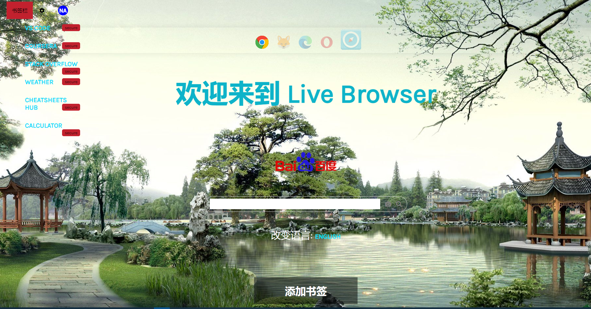

# Live Browser

*Live Browser* is a fully browser based (funny) BROWSER!! made with html css js.  You can Search Google and Bookmark Your own favorite websites and You got some beautifull website as a Default Bookmark(that's also my projects). 

# Demo

[Demo](https://naemazam.github.io/Live-Browser/)

# Feature: 
 - Google Search Box
 - Browser Detection 
 - Add Bookmark
 - Virtual Keyboard
 - Coming soon more .... 

# Learn More
[Read Blog](https://dev.to/naemazam/live-browser-make-a-browser-based-browser-26bh)

# Contribution 

YES!! help me to devlope it more. 

